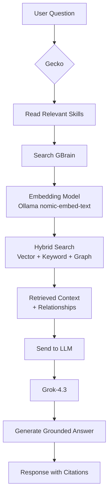

# Gecko + GBrain Architecture Flow

## Simple Overview

## Detailed Flow

1. **User asks a question**
2. **Gecko reads relevant Skills** (e.g. `gecko-gbrain-usage.md`, `financial-analysis-framework.md`)
3. **Gecko searches GBrain**
   - Uses **Ollama embedding model** to convert query into vectors
   - Performs hybrid search (vector + BM25 + knowledge graph)
4. **GBrain returns** relevant chunks + entity relationships
5. **Gecko sends context + rules to Grok-4.3**
6. **Grok-4.3 generates** the final answer (following skill rules)
7. **Response is returned** with proper citations and grounding

## Key Components

| Component              | Model / System       | Role |
|------------------------|----------------------|------|
| Embedding              | Ollama (nomic-embed-text) | Semantic search |
| Knowledge Graph        | GBrain               | Typed entity relationships |
| Reasoning & Generation | Grok-4.3             | Final answer generation |
| Rules & Behavior       | Skills (markdown)    | How Gecko should use the brain |

## Why This Matters

- **Ollama** is only used for retrieval (search)
- **Grok-4.3** is used for thinking and writing
- **Skills** ensure consistent, grounded behavior
- **Graph** enables relationship-aware answers beyond simple similarity search
